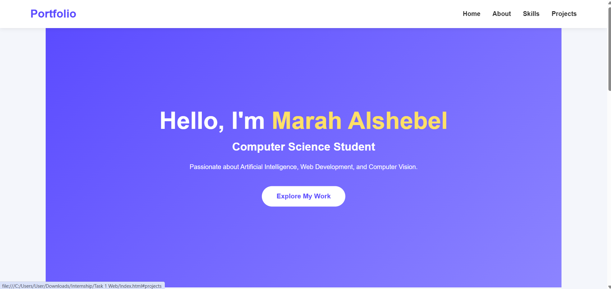
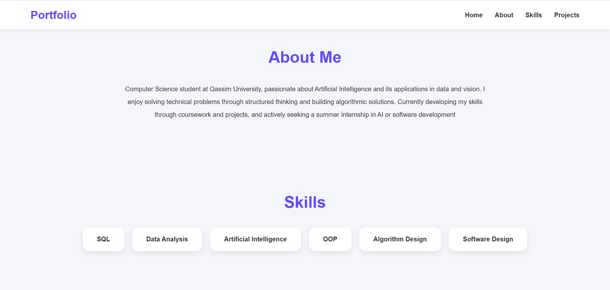
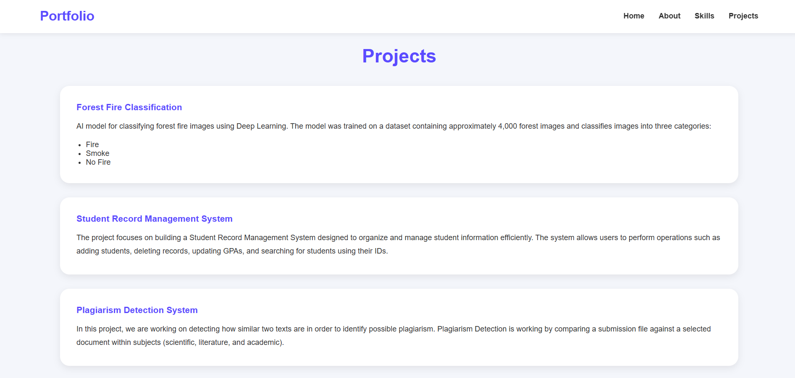

# Personal Portfolio Website

A simple personal portfolio website developed using HTML and CSS to introduce myself, my academic background, technical skills, and projects.


## Overview
The website includes multiple sections that present personal and academic information in a clean and organized layout:
- Home
- About Me
- Skills
- Projects 
The purpose of this project is to practice building a responsive front-end webpage using fundamental web technologies.

## Website Preview
The following screenshot shows the portfolio homepage.





## Technologies Used
- HTML5
- CSS3


## Project Files
```
Personal-Portfolio/
│
├── index.html
├── style.css
└── README.md
```

| File | Description |
|------|-------------|
| [index.html](index.html) | Main webpage containing the portfolio structure |
| [style.css](style.css) | Stylesheet used to design and format the webpage |


## Features
- Responsive navigation bar
- Hero section introducing the portfolio
- About Me section
- Skills section
- Projects section
- Modern and clean user interface


## How to Run
1. Download or clone the repository.
2. Open the project folder.
3. Double-click `index.html` or open it using any web browser.
4. Explore the different sections of the portfolio.


## Website Sections
### Home
Introduces the portfolio owner with a short professional summary.

### About Me
Provides academic background and career interests.

### Skills
Displays technical skills and areas of knowledge.

### Projects
Highlights selected academic projects and their descriptions.


## Future Improvements
Possible improvements include:
- Add JavaScript for interactive features.
- Include project images and icons.
- Add a Contact section with social media links.
- Improve responsiveness for different screen sizes.
